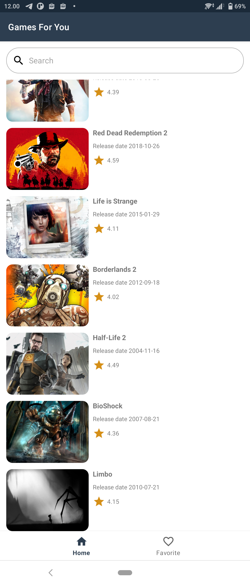
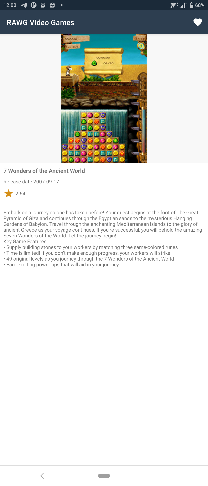
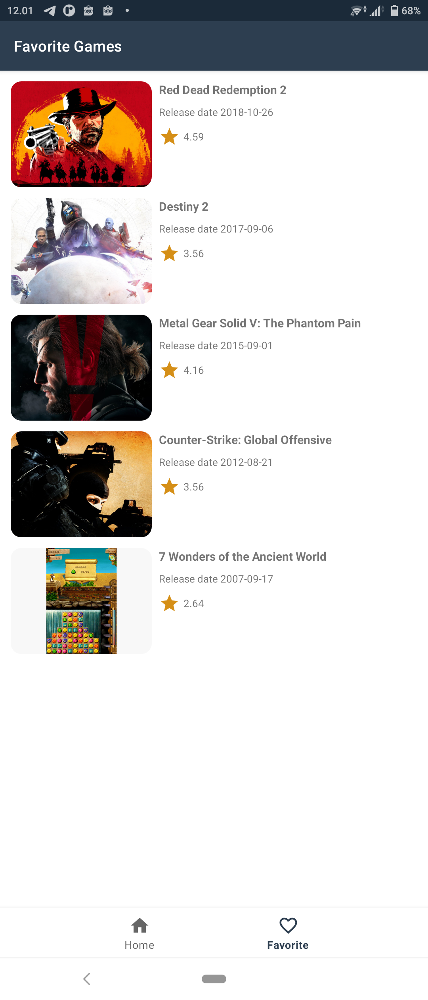
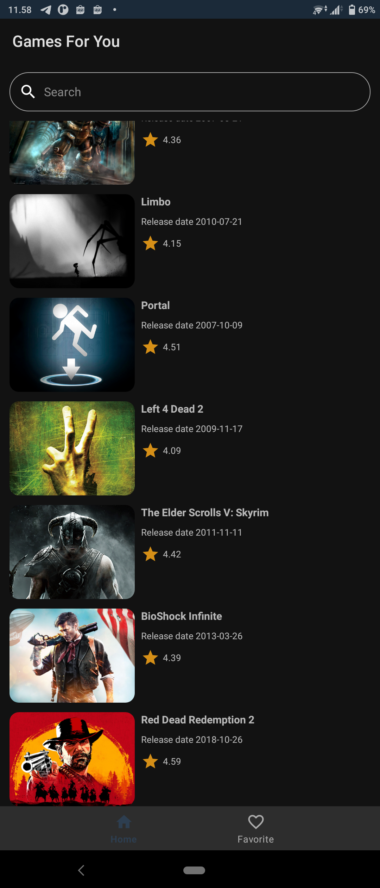
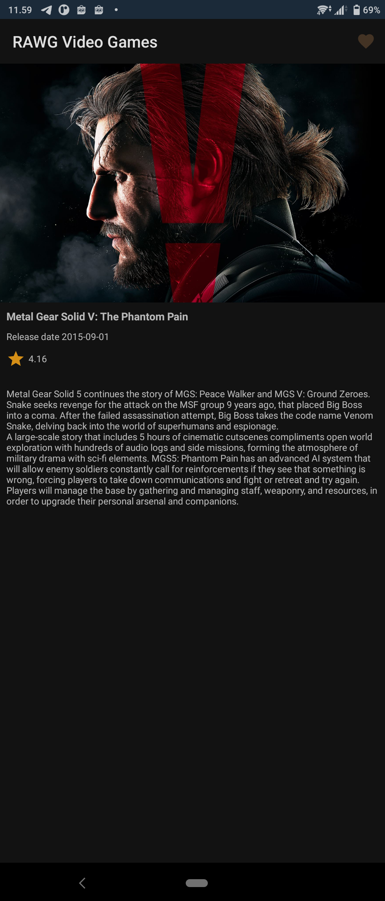
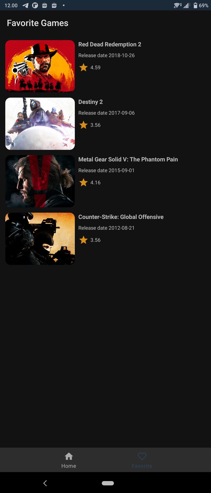

# RAWG Video Games
 Technical Assessment (CAN Creative) - Android Developer

## Screenshot

### Light Mode

### Dark mode

 
## Specs

- Implement RAWG API
- Implement Architecture MVVM

## Features

- Game List dengan Paging
- Search Game dengan Paging
- Detail Game
- Save favorite game ke local database
- 